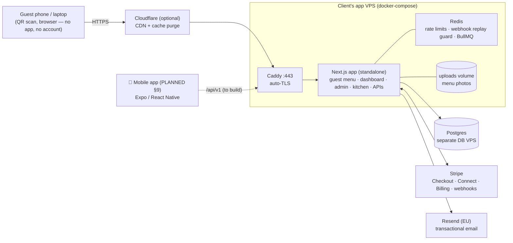
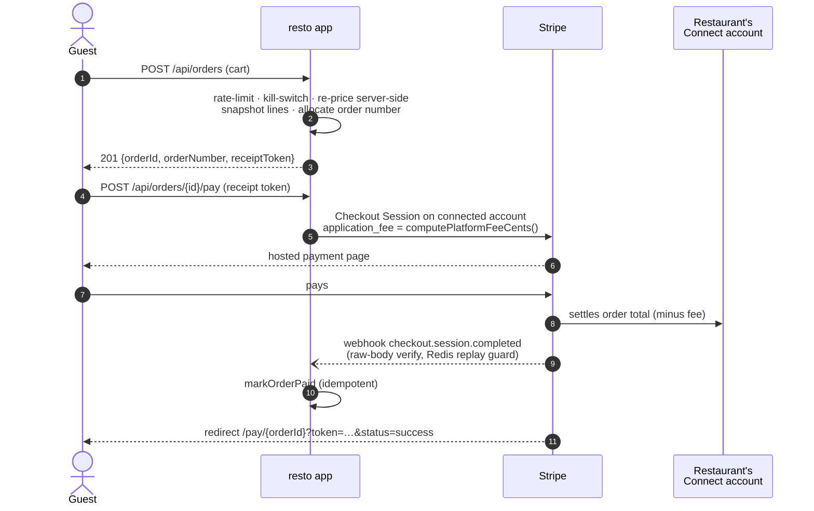
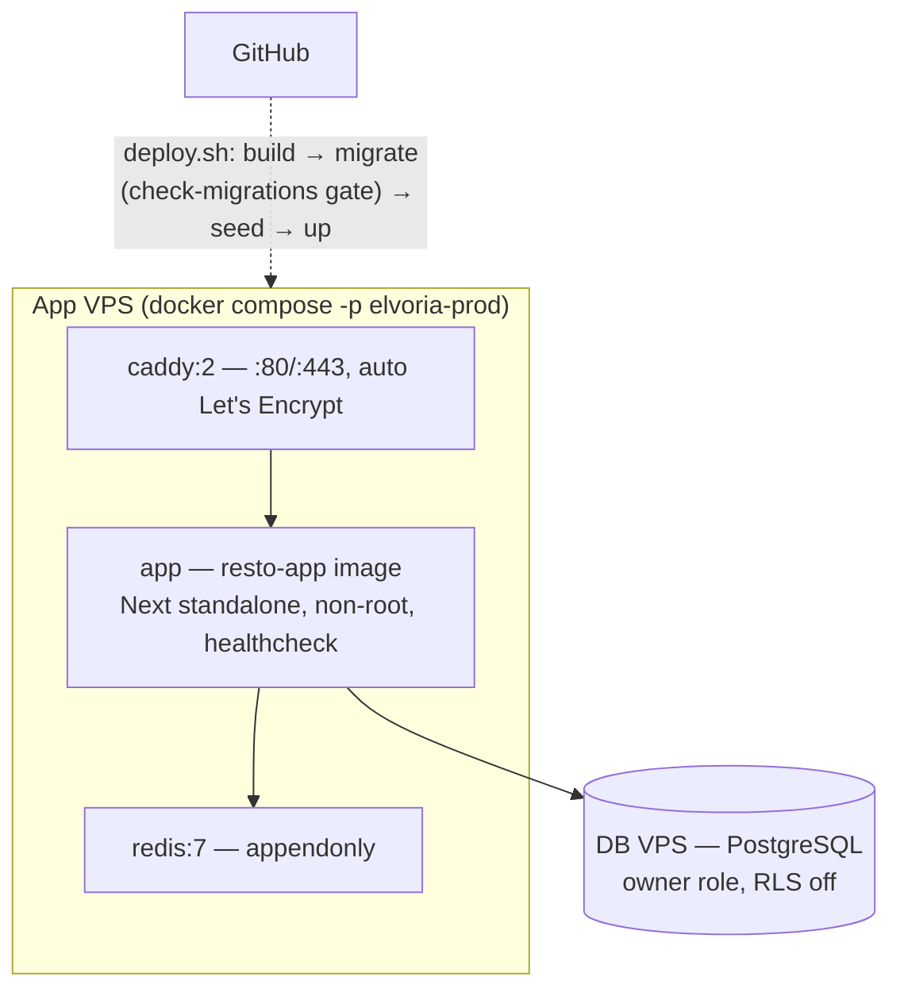
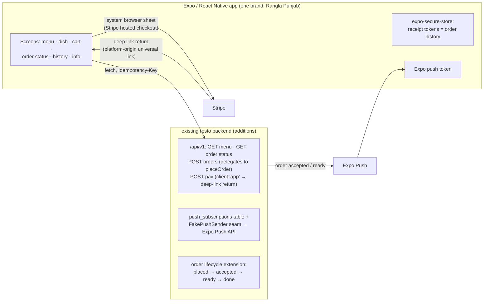

# resto — System Architecture (Rangla Punjab deployment)

> **Status (2026-08-15).** The web application is **code-complete**: 28 of 30 backlog tasks done,
> 437 tests passing. The two remaining tasks are deliberately human-gated go-live steps
> (P6-2 provision VPS + DNS, P6-3 live Stripe keys + Connect onboarding + €0.50 smoke test).
> The **mobile app does not exist yet** — its target architecture is §9.
> This document supersedes the parent-era `docs/architecture.md` (which still describes the
> removed AI-import job and the multi-tenant SaaS posture).

**What resto is:** a white-label, single-restaurant ordering platform — one deploy per client
(own VPS, own domain, own `prod.env`, own Stripe). This repo instance is being completed for
**Rangla Punjab**. It was forked from the multi-tenant Elvoria/Guesto SaaS and deliberately
simplified: no self-signup, no SaaS plan tiers, no discovery, menu at the domain root.

---

## 1. Stack

| Layer | Choice |
| --- | --- |
| Framework | Next.js 16 App Router, `output: "standalone"`, React 19, TypeScript strict |
| Styling | Tailwind 4; menu themes as CSS custom properties (11 themes, 4 textures) |
| Database | PostgreSQL (remote DB VPS in prod; Docker locally), Prisma 7 + pg adapter |
| Queue/cache | Redis 7 (BullMQ, rate limits, webhook idempotency) |
| Payments | Stripe only — Connect destination charges, own-keys direct charges, support subscription |
| Email | Resend (prod) / MailHog (dev) / console — transport switchable at runtime from `/admin` |
| Images | Local disk `public/uploads/` + sharp resize via `/img/[key]` (S3/imgproxy removed in fork) |
| PDF | pdf-lib — 80 mm receipts, A4 QR table-tent pack |
| Observability | prom-client `/api/internal/metrics`, OTel (OTLP), Sentry seam, request-id middleware |
| Runtime | Docker (4-stage build, non-root), Caddy TLS reverse proxy, docker-compose per VPS |

## 2. System context

**Single-tenant posture:** the public menu lives at the domain root (`/`, `/{locale}`), the venue
is resolved from `RESTAURANT_SLUG` (env, DB fallback). Full multi-tenant machinery (tenant_id
columns, RLS policies, GUC-scoped transactions, isolation tests) **still exists in code and dev/CI**
but prod deliberately connects as the single owner role with RLS off — documented in
`deploy/docker-compose.prod.yml` and `src/lib/env.ts`.

## 3. Surfaces (route map)

| Surface | Routes | Notes |
| --- | --- | --- |
| **Guest menu** | `/`, `/{locale}` | Server-rendered, zero-JS critical path (enforced budget); diet/category tabs are URL-driven (works without JS); `?preview=` shows draft |
| **Cart / ordering** | client islands on `/` | Lazy cart drawer, localStorage state, POST `/api/orders` |
| **Pay** | `/pay/[orderId]?token=` | Receipt-token authorized; Stripe return leg lands here |
| **Owner dashboard** | `/dashboard/(console)/*` | Overview, orders (auto-print), menu editor, appearance, settings + delivery areas, billing (support plan + Connect + own keys), QR, branch switcher |
| **Operator admin** | `/admin/*` | Fee mode/bp/threshold, site kill switch, **encrypted Stripe keys editable at runtime**, email transport, restaurant provisioning, templates, announcements, audit, backups, runbooks, system health |
| **Kitchen** | `/kitchen` | Dark KDS, 7 s refresh, chime, wake lock, fullscreen |
| **Print** | `/print/order/[id]?auto=1` | 80 mm kitchen ticket |
| **Auth** | `/login`, `/reset/*`, `/verify/*` | No public signup (removed) — owners are provisioned from `/admin` |
| **Legal** | `/legal/*` | MDX: privacy, terms, impressum, DPA, accessibility |
| **APIs** | `/api/*` | auth, menu CRUD + publish, orders + pay + receipt, Stripe webhooks (×2), PayPal return + webhook, billing, QR, zip-lookup, metrics |

## 4. Data model (20 models, grouped)

- **Identity/auth:** `User` (argon2id, `sessionsValidFrom` cutoff, `isPlatformAdmin`),
  `Membership` (role owner|staff), `EmailVerificationToken`, `PasswordResetToken` — opaque
  hashed tokens, never JWTs.
- **Restaurant:** `Tenant` (status, Stripe Connect id + charges flag, **encrypted own-Stripe keys**),
  `Venue` (slug, timezone, currency, locales, `branding`/`ordering`/`hours` JSONB), `SlugRedirect`.
- **Menu content:** `Menu` → `MenuVersion` (draft/published) → `Category` → `Item` (integer-cent
  prices, EU-1169 allergens/traces, dietary, spice) → `ItemVariant`; `Translation` (per entity ×
  field × locale); `Media` (local storage key, dimensions); `MenuTemplate` (starter menus,
  platform-owned).
- **Orders:** `Order` (per-venue `orderNumber`, `orderType` dine_in|takeaway|delivery,
  `paymentStatus` none|pending|paid, price-snapshot totals, `requestedFor` scheduling,
  delivery address JSONB, `applicationFeeCents`), `OrderItem` (name+price snapshot, no FK to Item —
  a later menu edit can never rewrite a receipt).
- **Money/ops:** `Subscription` (single `support` plan), `OperatorSettings` (singleton: fee mode,
  kill switch, email transport, app theme, **AES-GCM-encrypted Stripe keys**), `ScanStat`
  (monthly-partitioned analytics), `AuditEvent` (partitioned, 24-month retention).

## 5. Ordering & payment flows

Order lifecycle today: `placed → done`, payment `none | pending | paid`. Cash orders
(`paymentStatus: none`) settle at the counter; the receipt PDF deliberately prints no payment
section.

**Three Stripe modes** (operator-selectable, no redeploy):

| Mode | Who charges | Platform fee | Settled by |
| --- | --- | --- | --- |
| `percentage` (default) | Restaurant's **Connect** account, destination charge | `feeBp` (default 500 = 5 %) above `feeMinCents` (€20); 0 below | `/api/stripe/webhook` |
| `upfront` + own keys | Restaurant's **own Stripe account** (encrypted keys pasted in dashboard) | 0 — restaurant keeps 100 % | `/api/stripe/own-webhook` |
| Support subscription | Operator charges the restaurant ~€20/mo (Stripe Billing) | — | webhook; overdue = banner only, never blocks ordering |

**Config-at-runtime:** platform Stripe keys, fee knobs, email transport, and the ordering kill
switch live in `OperatorSettings` (DB, AES-GCM at rest, masked in UI) with env fallback — a key
rotation is an `/admin` form, not a redeploy.

## 6. Deployment topology

- `deploy/deploy.sh release` = build → migrate (expand-contract gate) → idempotent seeds
  (platform admin, menu templates, restaurant) → up.
- Per-client configuration is **one `prod.env`** (`deploy/prod.env.template`): brand name, domain,
  restaurant identity, owner/admin credentials, Stripe, Resend, optional Cloudflare/Sentry/OTel.
- ⚠️ **Known contradiction:** `.github/workflows/deploy-to-ionos.yaml` still contains the parent
  project's PM2/`/var/www/guesto` deploy and must be deleted or rewritten before wiring CI deploys
  (§10, gap D1).

## 7. Security model

- Sessions: HMAC-signed cookie (`{u, exp}`), host-only, httpOnly; `sessionsValidFrom` gives
  blanket revocation; impersonation carries an explicit claim re-verified server-side.
- Passwords argon2id (OWASP 2024 params); verify/reset tokens opaque, SHA-256-hashed, TTL, single-use.
- Anonymous guest reads/writes are authorized **only** by the HMAC receipt token (possession =
  permission) — no guest accounts anywhere.
- Redis fixed-window rate limits on login, reset, orders (per IP and per email where relevant).
- Secrets at rest: AES-GCM (`secrets.ts`), masked rendering, write-only UX.
- Webhooks: raw-body signature verification, replay-guarded via Redis, 500 → Stripe retry.
- Guest pages: zero cookies, no analytics, enforceable JS budget; kill switch returns 503
  `ordering_paused` without touching the menu.

## 8. Observability & ops

Prometheus scrape behind `INTERNAL_METRICS_TOKEN` · OTel traces/metrics when OTLP endpoint set ·
Sentry seam · structured logs with request-id · partitioned `ScanStat`/`AuditEvent` with
`partition-manager` · restore drill script + golden file · runbooks + SLO catalogue rendered
at `/admin/runbooks`.

⚠️ The two BullMQ repeatables (`partition-maintain`, `slow-query-report`) are **registered but no
worker process runs in prod** (§10, gap D2 — same class of bug the parent fixed).

---

## 9. Mobile app — target architecture (TO BUILD)

Per the client proposal: native **Android + iOS** with ordering, payment and **push
notifications**. Recommended shape (proven in the parent project, simplified for one restaurant):

Settled design rules (inherit from the parent's mobile decisions — do not re-litigate):

1. **No guest accounts, no login.** The receipt token returned by order placement is the whole
   credential; the app stores its own tokens in `expo-secure-store` as local order history. No
   customer table, no passwords, no JWTs.
2. **No payment SDKs, no native card fields.** Stripe hosted Checkout opens in
   `ASWebAuthenticationSession` / Chrome Custom Tabs; the return URL is an app deep link that
   falls back to the web `/pay/[orderId]` page when the app isn't installed. PCI stays SAQ-A.
3. **The app is a viewer of payment state, never an authority.** It polls
   `GET /api/v1/orders/{id}/status` after the browser sheet closes; it never infers "paid" from
   the sheet closing. Settlement stays webhook + return leg.
4. **Versioned `/api/v1` from day one**; unversioned web routes stay for the browser; v1 routes
   delegate to the same service functions (`placeOrder`, `getOrderForReceipt`, `loadPublicMenu`).
   Money = integer cents; image URLs absolute; clients tolerate unknown enum values.
5. **Push** (in scope for this client, unlike the parent): tenant-scoped `push_subscriptions`
   (Expo push token, idempotent registration), a provider seam with a fake for CI, triggers on
   order `accepted`/`ready`. This **requires extending the order lifecycle** beyond
   `placed → done` — recommended `placed → accepted → ready → done`, decided by one pure
   `canTransition()` and driven from the kitchen/orders screens.
6. **Stack:** TypeScript, Expo Router, Zustand (cart), TanStack Query, `fetch`, EAS Build;
   theme values ported from the venue's chosen menu theme; system fonts.
7. **Store accounts** (Apple Developer, Google Play) are the client's own, per the proposal —
   start enrolment immediately; Apple can take weeks.

**Mobile build order:** ① `/api/v1` read endpoints + contract types → ② app skeleton: menu +
cart + place order → ③ pay via browser sheet + deep-link return → ④ order status polling →
⑤ lifecycle extension + kitchen buttons → ⑥ push seam + Expo wiring → ⑦ EAS builds + store
submission.

---

## 10. Gap register — what "complete" still requires

| # | Gap | Severity | Where |
| --- | --- | --- | --- |
| **S1** | **Rotate the live Stripe key sitting in `.env`** (backlog's own final note) and delete the three `.env.bak.*` files from the working tree | 🔴 security, do first | repo root |
| D1 | Stale parent deploy workflow (PM2, `/var/www/guesto`) contradicts `deploy/deploy.sh` — delete or rewrite | 🔴 before first CI deploy | `.github/workflows/deploy-to-ionos.yaml` |
| D2 | BullMQ repeatables have no running worker in prod; `package.json "worker"` points at a deleted file | 🟠 | `src/lib/queue.ts`, `package.json` |
| B1 | Rebrand residue: 76 "guesto" + 50 "elvoria" hits in `src/` (localStorage keys, logos, docs titles, container names, `package.json` name) | 🟠 cosmetic but client-visible | repo-wide |
| B2 | Parent-era docs are misleading (`docs/architecture.md`, `docs/SERVICES.md` §3, spec/roadmap) — archive or delete | 🟡 | `docs/` |
| F1 | No guest order-status page (confirmation lives only in the cart drawer); mobile needs a status endpoint anyway — build once, use twice | 🟠 | new `/api/v1/orders/{id}/status` + page |
| F2 | Order lifecycle too thin for push/status UX (`placed → done` only) | 🟠 | `order-service.ts` |
| F3 | Seeds (`seed-indian-restaurant.ts`, `seed-demo-venue.ts`) print dead `/r/{slug}` URLs | 🟡 | `scripts/` |
| F4 | PayPal: shown as an accepted-payment chip but not implemented as a rail. Either implement (parent has a proven blueprint) or descope in the client agreement | 🟡 decision | — |
| F5 | Reservations: none in code; listed as an optional add-on in the client proposal — keep descoped unless sold | 🟡 decision | — |
| M1 | Entire mobile app (§9) | 🔵 main remaining build | `apps/mobile` (new) |
| G1 | Go-live: P6-2 VPS + DNS, P6-3 live keys + Connect onboarding + €0.50 smoke | ⛔ human | `BACKLOG.md` |

**Definition of done for "Rangla Punjab complete":** S1 + D1 fixed → G1 executed (web live) →
M1 built through the §9 build order → store submission. B/F items slot in as capacity allows;
F1+F2 are prerequisites of the mobile push experience.
