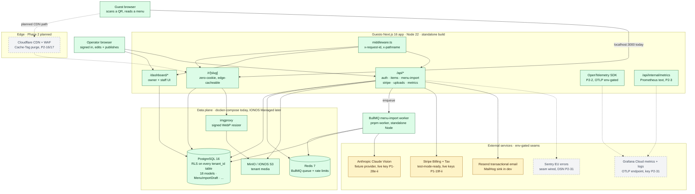
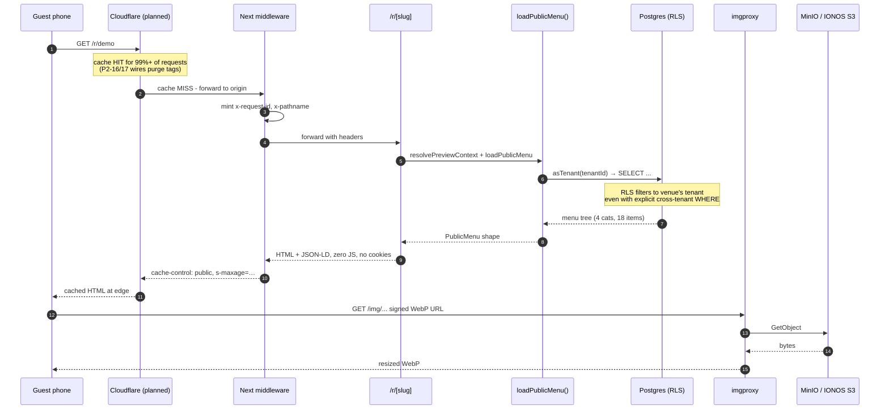
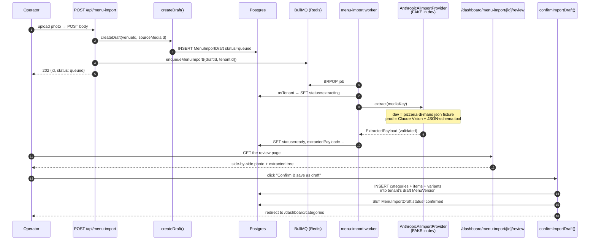
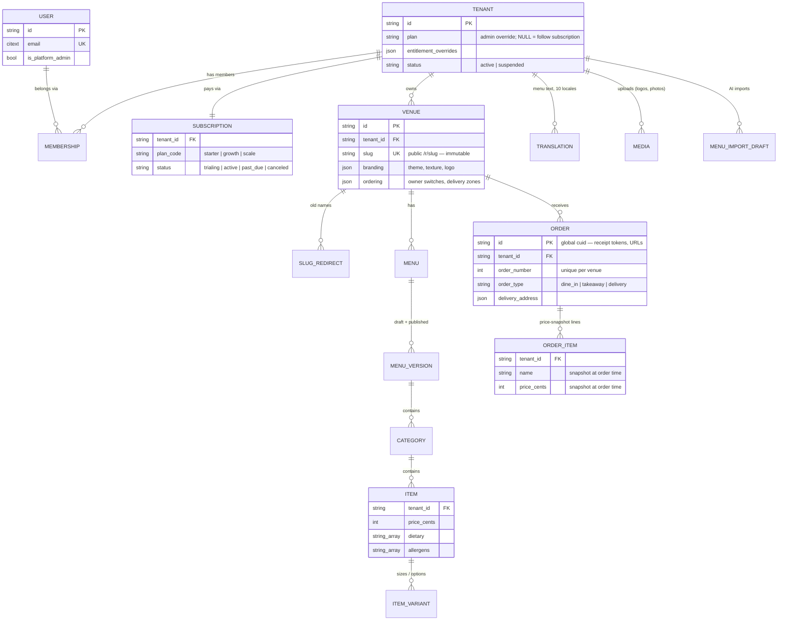
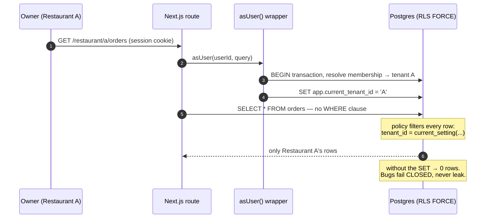
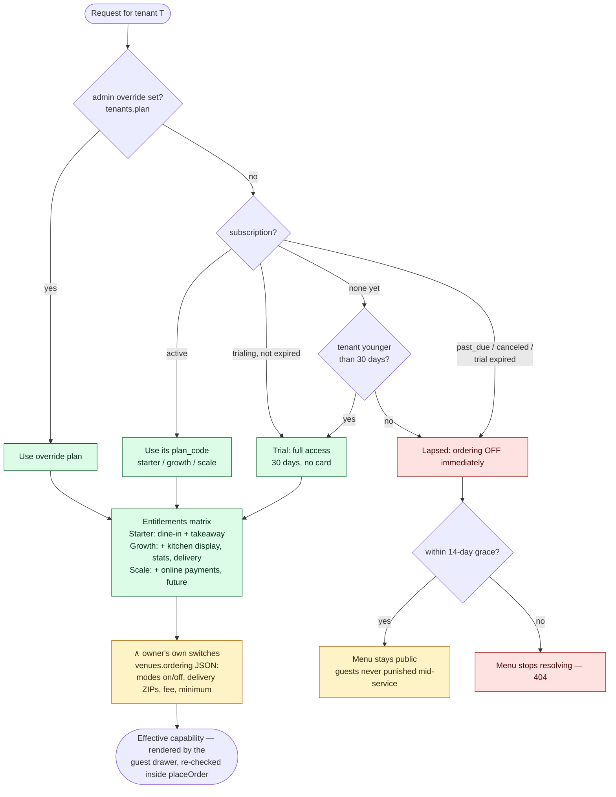

# Guesto — Architecture

A single-page tour of the running system. Diagrams render on GitHub, in
VS Code's Markdown preview with the Mermaid extension, and at
[mermaid.live](https://mermaid.live) if pasted.

Legend for the boxes:

- **green** — real, running, covered by tests
- **yellow** — code path is real, but it defaults to a fake provider
  until the human unblocks the live-key gate
- **grey / dashed** — planned in Phase 2, seam exists, not wired yet

---

## 1. System topology

---

## 2. Guest reads a menu — the hot path

The single most important flow: someone scans a table QR and gets
their menu. Zero cookies, zero JavaScript required, edge-cacheable
for >99% hit-ratio at scale.

---

## 3. AI menu import — job path

Operator uploads a photo, the AI extracts a structured payload, the
operator reviews + confirms, and the extraction lands in the tenant's
draft menu. Dev + CI run against a committed fixture; the live
Anthropic path is gated by `P1-28e-ii` until the human provisions a
key and counsel signs off on the PII draft in `/legal/dpa` §12.

---

## 4. Entity model — every restaurant in one database

Twenty tables, one database. Every table that stores restaurant-owned
data carries a `tenant_id` stamp — that column is the isolation
boundary (see §5). Only `users` and the login-token tables are
platform-global: an account exists before it joins a restaurant.
`audit_events` and `scan_stats` (tenant-stamped, partitioned by month)
are omitted from the picture for legibility.

---

## 5. Tenant isolation — the life of a dashboard request

Separation is enforced by PostgreSQL Row-Level Security (`FORCE` on
every tenant table), not by application code remembering to filter.
The policy on every table is
`tenant_id = current_setting('app.current_tenant_id')`; the app
declares the tenant per transaction through the `asUser` / `asTenant`
wrappers in `src/lib/tenant.ts` and never queries outside them.

The deliberate doors through the wall are four hand-written
`SECURITY DEFINER` functions, each a narrow projection:
`resolve_public_venue(slug)` (guest QR scan), `list_public_venues()`
(sitemap), `admin_list_tenants()` / `admin_set_tenant_plan()`
(platform console, gated by `users.is_platform_admin`). Beyond the
database: S3 keys are prefixed `{tenantId}/uploads/…`, dashboard URLs
404 unless the slug belongs to the session's venue, and receipt links
carry HMAC tokens bound to the tenant.

---

## 6. Per-restaurant business logic — plan, trial, and feature gates

What one restaurant can do is derived — never stored as a flat flag —
by `resolveTenantAccess()` in `src/lib/plan-state.ts`, the single
derivation used by the order API, the public menu, the dashboard, and
the platform console:

Two properties worth keeping true forever:

- **The server re-derives everything.** The guest drawer renders only
  the allowed modes, but `placeOrder` re-runs the same derivation
  inside its transaction — a forged POST for an unentitled feature
  gets `type_not_available`, the same trust model as recomputing every
  price from the database.
- **Effective capability = plan entitlement ∧ owner switch.** The plan
  is the ceiling Guesto sells; the switches are the owner's own
  on/off beneath it ("driver is sick tonight"). Neither alone grants
  anything.

---

## 7. Where things live (file map)

Files a new engineer would open first, grouped by concern.

| Concern | Key files |
|---|---|
| **Product spec** (what to build) | `ELVORIA_MENU_SPEC.md` |
| **Roadmap** (phased delivery plan) | `ELVORIA_ROADMAP.md` |
| **Task queue** (loop works through this) | `BACKLOG.md` |
| **Architectural decisions** | `CLAUDE.md` — "Decisions log" section |
| **Data model** | `prisma/schema.prisma` (18 models + enums) |
| **Migrations** | `prisma/migrations/*/migration.sql` (12 folders) |
| **RLS policies** | `prisma/migrations/20260711215814_rls_policies/migration.sql` + inline blocks in later migrations |
| **App runtime** | `src/app/**` — App Router routes, page + route handlers |
| **Middleware** | `src/middleware.ts` — request-id + pathname injection |
| **Instrumentation hook** | `instrumentation.ts` — Sentry stub + OTel boot |
| **Domain services** | `src/lib/**` — one file per concern (`auth-service.ts`, `items-service.ts`, `billing-service.ts`, `menu-import/*`, …) |
| **BullMQ worker** | `src/workers/menu-import.ts` |
| **Public menu view** | `src/app/r/[slug]/page.tsx` + `menu-view.tsx` |
| **Owner admin surface** | `src/app/dashboard/admin/{runbooks,backups}/page.tsx` |
| **Legal MDX** | `src/content/legal/*.mdx` (5 files, `TODO: legal review` markers until counsel signs) |
| **Operator runbooks** | `src/content/runbooks/*.mdx` (6 files, on-call playbooks) |
| **Infra as code** | `infra/terraform/*.tf` (validates locally, `apply` gated by P0-11-ii) |
| **CI workflow** | `.github/workflows/ci.yml` — lint, tsc, vitest, RLS test, axe, LHCI, image build |
| **Env contract** | `src/lib/env.ts` (parsed at boot, fail-fast) + `.env.example` |
| **Local dev stack** | `docker-compose.yml` (postgres, redis, minio, mailhog, imgproxy) |

---

## 8. Live status (regenerate before you cite it)

These numbers were pulled at the P2-7 commit. They drift with every
merge; run the commands in the rightmost column to refresh.

| Metric | Current | How to re-check |
|---|---|---|
| Prisma models | 18 | `grep -c '^model ' prisma/schema.prisma` |
| Migrations | 12 | `ls prisma/migrations \| grep -v migration_lock \| wc -l` |
| Phase 1 tasks (code) | 30/30 done | `grep -c '^- \[x\] (P1-' BACKLOG.md` |
| Phase 2 tasks | 7/37 done | `grep -c '^- \[x\] (P2-' BACKLOG.md` |
| ⛔ human-gated tasks open | 4 | `grep -c '⛔ needs-human' BACKLOG.md` (filter unchecked) |
| Vitest cases | 364 passing | `pnpm test` |
| Playwright axe on `/r/demo` | 2/2 passing | `pnpm test:axe` |
| Lighthouse mobile perf | 97-98 | `pnpm test:lhci` |
| Lighthouse mobile a11y | 100 | (same) |
| LCP on `/r/demo` (Slow 4G) | ~2.3-2.5 s | (same) |
| Public menu transfer | ~240 KB total | (same, `resource-summary`) |
| Restore-drill golden | 5 items, checksum `709ab42a…` | `pnpm restore-drill` |

---

## 9. Open human gates (what stops "URL a customer can visit")

Everything else runs. These four steps need a person:

| Task | Blocking action | Estimate |
|---|---|---|
| **P1-19f-ii** | Log into Stripe test-mode dashboard, create 3 products, paste 5 keys into `.env` | ~15 min |
| **P1-22c-ii** | Counsel reviews `src/content/legal/*.mdx` + `/legal/dpa` §12, edits in place, removes `TODO: legal review` markers | counsel-dependent |
| **P1-28e-ii** | Provision Anthropic workspace API key with EU data-residency addendum, paste as `ANTHROPIC_API_KEY`, counsel confirms PII draft | ~1 h + counsel |
| **P0-11-ii** | First real `terraform apply` against IONOS + Cloudflare accounts (bills money) | ~3 h first-time |

The **free-tier deploy path** (Vercel + Neon + Upstash + Cloudflare R2 +
Resend) bypasses `P0-11-ii` entirely for a demo/staging cut at €0/mo.
Only Anthropic still needs the $5 minimum credit for the AI import to
work with real photos.

---

## 10. Maintenance

This file is checked in as-is. The numbers in §5 drift — treat them
as "the state at the last commit that edited this file", not as
authoritative. Regenerate when you need to cite them.

Diagrams update by hand when a new subsystem lands. Rule of thumb:
if a task adds a new arrow in section 1 (a new external service, a
new worker, a new data store), amend `docs/architecture.md` in the
same commit.
